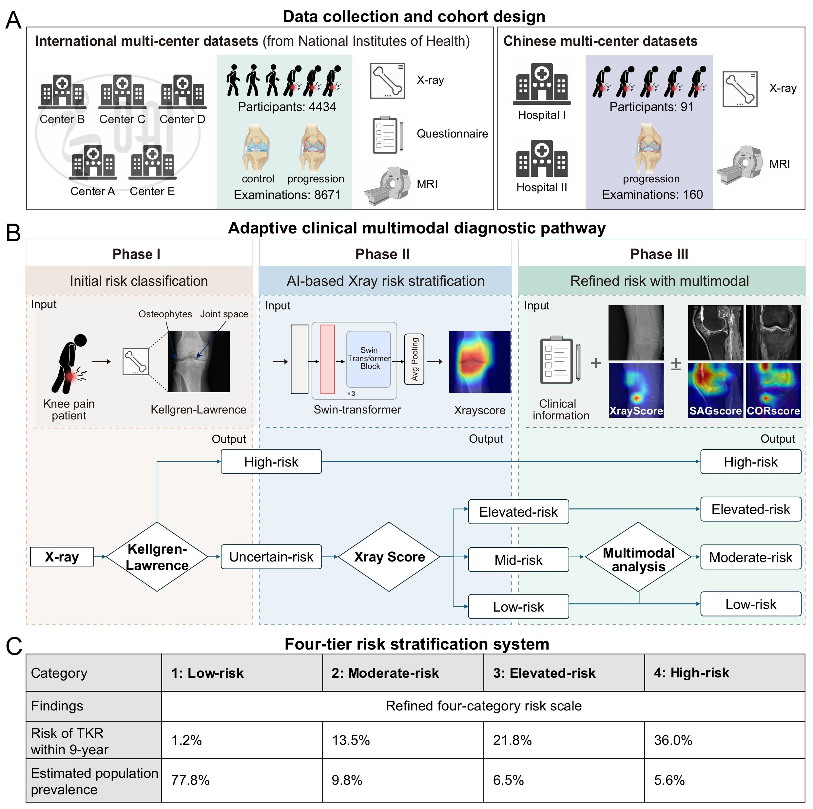

# Multimodal imaging and clinical data-driven risk stratification for precision management of knee osteoarthritis: an international multicenter study
Accurate surgical risk prediction for total knee replacement (TKR) is critical for precision management of knee osteoarthritis (KOA), yet current Kellgren-Lawrence (K-L) grading exhibits limited efficacy, and multimodal diagnostic decisions lack quantitative standards. To address this, we conducted an international multicenter study of 4,725 eligible KOA participants (8,831 knees) from the Osteoarthritis Initiative and Chinese hospitals, developing and validating three Swin Transformer-based imaging models using X-ray and MRI data, which were integrated with clinical factors to create TKR-Finder. This multimodal deep learning tool demonstrated exceptional predictive performance, achieving AUC values >0.860 for 3-, 5-, 7-, and 9-year TKR prediction in two external validation cohorts (2,242 knees). We further constructed a knowledge-guided, AI-driven three-phase decision tree algorithm to optimize clinical pathways, revealing that only patients with intermediate X-ray Scores (0.083–0.743) and impaired life quality scores (< 75) require additional MRI evaluation. Compared to K-L grading, our four-tier risk classification system (Low-, Moderate-, Elevated-, and High-risk) enabled superior stratification with clear intergroup separation. TKR-Finder represents a transformative advance in KOA management, offering precise risk prediction, personalized imaging recommendations, and workflow-compatible decision support to facilitate earlier interventions that may delay or prevent TKR, with robust generalizability across international cohorts.

## Requirements

- Python (3.10)
- torch (2.1.0+cu121)
## Usage

1. Data Preparation
	You need to prepare the following files:

	- **Imaging files**: The format should be structured as follows:
		```
		Train_Cohort
		├── Center I
		  ├── Crop_AX_Smax+1_0001_image.nii.gz
		  ├── Crop_AX_Smax+0_0001_image.nii.gz
		  ├── Crop_AX_Smax-1_0001_image.nii.gz
		  ├── Crop_AX_Smax+1_0002_image.nii.gz
		  ...
		├── Center II
		├── Center III
		└── Center IV

2. Train:
    
     - **Install the PyTorch version with CUDA support.**
    
    ```
     pip install torch==2.1.0+cu121 torchvision==0.16.0+cu121 torchaudio==2.1.0 --index-url https://download.pytorch.org/whl/cu121
    ```
    
3. Predict:
     - **prediction model**
    ```
        python predict.py
    ```
     - **Output CAM figure**
    ```
        python main_swin.py
    ```

## our software
We developed a three-phase decision tree-based diagnostic pathway and user-friendly interface of TKR-Finder tool, which allows clinicians to input patient data efficiently and provides risk assessment results based on  the recommended diagnosis pathway. A knowledge-guided decision tree algorithm was constructed using X-ray Score and KOOS quality of life subscale to determine the necessity for additional MRI evaluation in TKR risk prediction. The decision threshold value was optimized based on optimal gini coefficient. Phase I: Initial risk stratification using K-L (K-L) grading as knowledge guidance—patients with K-L grade 4 are classified as very high TKR risk, while others proceed to Phase II. Phase II: X-ray Score-based stratification—patients with Scores <0.083 are classified as low TKR risk (no MRI needed), those with Scores >0.743 remain at high TKR risk (no additional MRI needed), and patients with intermediate Scores (0.083-0.743) proceed to Phase III. Phase III: KOOS quality of life-based decision—patients with Scores ≥75 are classified as relatively low risk and managed using the X-ray Plus module for final low-to-intermediate risk determination, while those with Scores <75 are classified as intermediate risk requiring MRI evaluation using the TKR Finder model for comprehensive risk assessment. KOA, Knee Osteoarthritis. SHAP, SHapley Additive exPlanations. TKR, Total Knee Replacement.

Our software and Sample data can be downloaded from [Google Drive](https://drive.google.com/drive/folders/1dhcZ0BilMwtlGWzz-wDv7N61HGaIS03i?usp=drive_link).


## Contact
If you have any questions, feel free to contact us through email ([chenxb@gdph.org.cn](mailto:chenxb@gdph.org.cn)) or GitHub issues. 

## Acknowledgements
The authors gratefully acknowledge the OAI study participants and investigators for providing the publicly available data. Data and/or research tools used in the preparation of this manuscript were obtained and analyzed from the controlled access datasets distributed from the Osteoarthritis Initiative (OAI), a data repository housed within the NIMH Data Archive (NDA). OAI is a collaborative informatics system created by the National Institute of Mental Health and the National Institute of Arthritis, Musculoskeletal and Skin Diseases (NIAMS) to provide a worldwide resource to quicken the pace of biomarker identification, scientific investigation and OA drug development. (DOI: 10.15154/cv2y-vv19). 